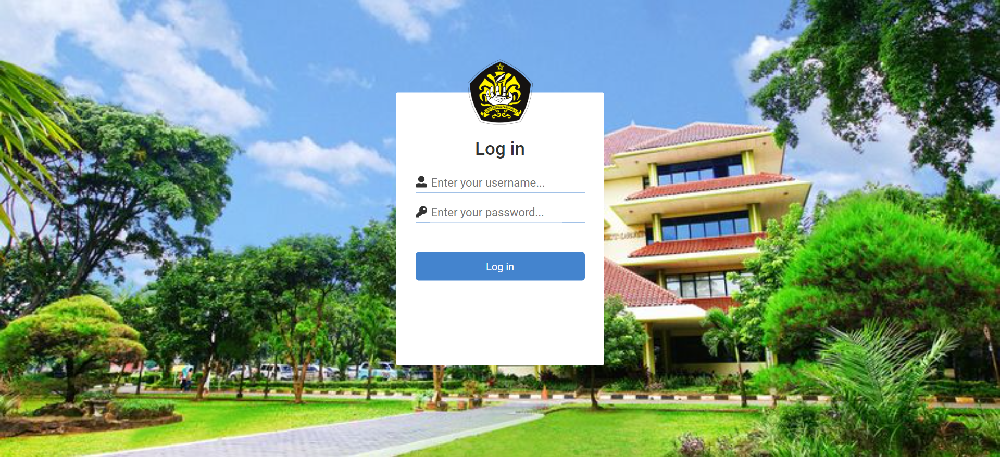

# Employee Attendance System

PHP-based website that was built to help companies keep track of employees' attendance.
 

Ini merupakan tugas pembuatan website menggunakan php native

## Key Features

- Check-in system for employee
- Attendance dashboard
- Managing employees' data
- Managing employees' shift
- Managing employees' department
- Print out absent report for a specific period of time.

## Screenshots

**Login Screen**

**Employee Attendance Screen**

**Admin Dashboard Screen**

**Employee List Screen**

**Employee Attendance Report Screen**

 

> Website ini dibuat untuk project uts mata kuliah Pemrograman Berbasis Web
